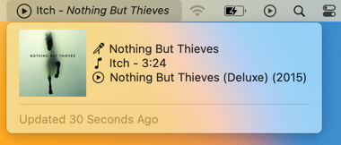

# Swiftbar Music Notifier

This plugin uses the iTunes/Music system-wide notifications for updating the "Now Playing" state using a streaming plugin.

There are two plugins. I started with a Python based one, and later moved on to Swift. Swift is the more up to date and capable version.



## A Swift Based Streaming Daemon for SwiftBar

SwiftBar allows 'streamable' plugins, which keep running in the background and can push updates when needed to SwiftBar, instead of SwiftBar polling them at a fixed interval.

Together with the iTunes/Music system-wide notification of state changes, this makes for a resource-friendly background process that can instantaneouly provide updated track information to SwiftBar.

For SwiftBar with fixed large payload streaming (requires the resolution of https://github.com/swiftbar/SwiftBar/pull/372), the Swift version also includes album art of the currently playing song. 

### Details

When the plugin starts, or it can only define a "Title" but no album, artist, etc. it goes into a polling mode once a second.

For Apple Music Streams, e.g. Radio, Endless playlists, etc. this is the only way to get reliable track information.

Finally, when listening to tracks from your music library, the player events kick in and don't require continuous polling.
Each new event queries Music for the current track and updates the plugin's output once, until the next event.

Resource consumption when listening to music from your library is practically none. Because the process remains alive for the polling, resource consumption is also lower than a script that checks iTunes/Music every second.

## Legacy: Python Version

The Python version was my first attempt and is retained as example, but not further maintained.

The biggest issue with the Python version is the small Python runner icon showing up in the Dock. I've worked around that by launching the process that requires access to the macOS Foundation framework in a subprocess. But overall it's not a great experience.

The version based on Swift contains a complete and self-contained notification based updater that requests the current track information via ScriptingBridge (same interface as AppleScript).

### Requirements

This plugin uses Python and the PyObjC bridge to interface with macOS. SwiftBar by default runs the System's Python, not a version installed via Homebrew or other means.

Run the following:

```shell
/usr/bin/python3 -m pip install --user pyobjc-framework-ScriptingBridge python-dateutil
```

### Details

The plugin uses the [`DistributedNotificationCenter`](https://developer.apple.com/documentation/foundation/distributednotificationcenter) to receive notifications from iTunes / Music about the changed state (play, pause, stop) and the metadata for new songs that start playing.

SwiftBar allows streamable plugins, where a plugin process remains alive and streams new data whenever it is available, separated by `~~~`. This script produces new entries whenever a new state is present.

On initial startup there is no "change" notification, so the initial state is retrieved via Scripting Bridge, which accesses the same endpoints an AppleScript would.

The Scripting Bridge integration in Python shows up as UI icon in the Dock while running. The initial check is thus redirected to a separate process that quickly retrieves the initial state and exits, removing the icon from the Dock as well.


